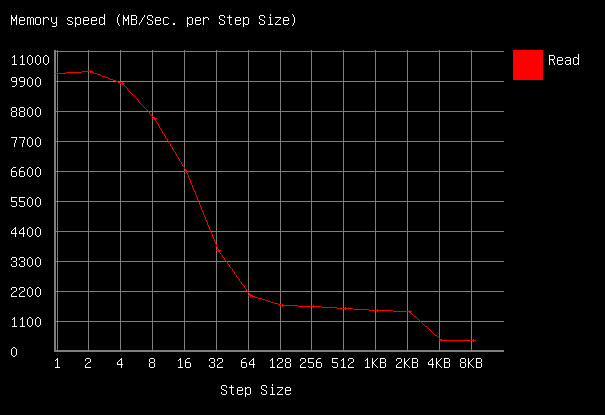

# BMAX Y13 Pro Benchmarking

I didn't see that many reviews of this laptop online, so i thought i'd give a go at benchmarking/testing all the components just to make sure everything works as expected.

## Physical appearence

In the box:

- Laptop
- Barrel jack charger (12v at 2A)
- Usb c to Usb a adapter

Things of note:

- The outside is made out of metal 
    - The inside is however is made of plastic
    - Trackpad surface is weirdly textured
        - Trackpad only clicks near the bottom
- Included screen protector feels incredibly cheap
- Keyboard has a backlight
    - Backlight glow looks suprisingly even
        - The lettering/print on the keycaps do not
    - Keyboard types suprisingly ok
        - Keyboard doesn't have the best key stabilisation, though

## General specifications

[CPU-Z Info](https://valid.x86.fr/anv3t9)

<iframe width="100%" height="500px" src="../23-06-24-bmax-y13pro-benchmark-extras/hwinfo.HTM"></iframe>

## Port speed - PASSABLE
(Tested using CrystalDiskMark, using a mediocre sd, can do about 80 MB/s)

This test is mainly to differentiate between usb 2 and usb 3 ports

MicroSD card slot|Read (MB/s)|Write (MB/s)
------ | ------ | ----- 
SEQ1M Q8T1|18.61|21.55
SEQ1M Q1T1|19.29|21.99
RND4K Q32T1|3.62|2.38
RND4K Q1T1|4.14|2.21

Right USB-C Port|Read (MB/s)|Write (MB/s)
------ | ------ | ----- 
SEQ1M Q8T1|46.93|24.07
SEQ1M Q1T1|45.26|26.36
RND4K Q32T1|4.45|2.59
RND4K Q1T1|3.88|2.15

Left USB-C Port|Read (MB/s)|Write (MB/s)
------ | ------ | ----- 
SEQ1M Q8T1|91.03|67.15
SEQ1M Q1T1|85.10|63.30
RND4K Q32T1|4.95|3.03
RND4K Q1T1|4.11|2.74

While the microsd slot is most certainly USB-2, the right USB-C port seems way slower than the USB-C port on the left. Despite that, neither operate at USB-2 speeds.

## Charger - NOT OK
The charger uses a twist mechanism to secure the right type of plug to the device. There is however, not enough tension to push the pins against the plug. This causes charging to become inconsistent.

## SSD - OK
(Tested using CrystalDiskMark)

Internal SSD|Read (MB/s)|Write (MB/s)
------ | ------ | ----- 
SEQ1M Q8T1|544.25|504.12
SEQ1M Q1T1|407.07|410.34
RND4K Q32T1|235.59|219.79
RND4K Q1T1|23.12|44.74

The SSD in windows is just called 'SSD 512GB'.
It does seem to be a SATA SSD though, not an NVME one.
Crystaldiskinfo reports the ssd being completely new.
Pulling out the SSD reveals the following model of SSD: 'Kston M.2 2280 SATA 512GB K765-512GB'

The SSD also seems to be real:

    liveuser@localhost-live:~$ sudo f3probe --destructive --time-ops /dev/sda
    F3 probe 8.0
    Copyright (C) 2010 Digirati Internet LTDA.
    This is free software; see the source for copying conditions.

    WARNING: Probing normally takes from a few seconds to 15 minutes, but
             it can take longer. Please be patient.

    Good news: The device `/dev/sda' is the real thing

    Device geometry:
    	         *Usable* size: 476.94 GB (1000215216 blocks)
    	        Announced size: 476.94 GB (1000215216 blocks)
    	                Module: 512.00 GB (2^39 Bytes)
    	Approximate cache size: 0.00 Byte (0 blocks), need-reset=no
    	   Physical block size: 512.00 Byte (2^9 Bytes)

    Probe time: 8.15s
     Operation: total time / count = avg time
          Read: 133.8ms / 4819 = 27us
         Write: 6.27s / 4192321 = 1us
         Reset: 1us / 1 = 1us

## Memory - OK
(Tested using Passmark memtest86)

<iframe width="100%" height="500px" src="../23-06-24-bmax-y13pro-benchmark-extras/memtest.html"></iframe>

## Cpu performance - PASSABLE
Tests were performed while plugged in

CPU-Z:

- Mutli-Thread: 213.7
- Single-Thread: 926.8

Tried running cinebench but gave up, took more than 10 minutes to prepare.

## Linux quirks
(Tested on Fedora 40)

- Screen rotation does not work (works with [this extension](https://extensions.gnome.org/extension/5389/screen-rotate/))
- The trackpad acts funky until you disable libinput quirks
