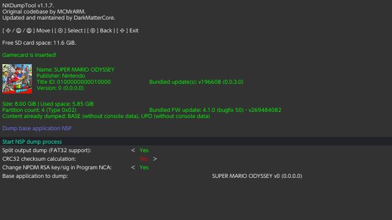

# Switch Dump and Install Guide
This guide has been made and tested using goldleaf 0.6.1 and nxdumptool 1.1.3

!!! danger "Ban risk"
	Installing any sort of nsp's gets you banned as soon as you connect to Nintendo services. KEEP YOUR SYSTEM ALWAYS OFFLINE AFTER INSTALLING ANY NSP!

!!! danger "EmuMMC is strongly recommended"
	Cause you need to keep your system offline after installing an nsp, EmuMMC is strongly recommended as with it you can still go online on sysnand while keeping your emummc permanently offline.

!!! warning "Remove all your wifi networks / set up 90dns on all your wifi networks"
	Again, in preparation for this you need to remove all your wifi networks or set up 90dns on all your wifi networks. Do this now.

## Step 1: Preparations 
This bit will get you the required files and programs for installing cart dumps

#### Downloads
- [The .nro version of GoldLeaf](https://github.com/XorTroll/Goldleaf/releases)
- [The .nro version of NXDumpTool](https://github.com/DarkMatterCore/nxdumptool/releases)
- <a href="../Img/hekate_ipl.ini" download>A Modified Hekate_ipl.ini</a>

### Instructions
1. Copy the .nro of Goldleaf and NXdumptool to the switch folder on your sd card
2. Replace the `hekate_ipl.ini` from the bootloader folder with the one you just downloaded
	- Note: you need to be booting via hekate for this to work, fusee-primary will not work
	- Note: If you copied these files while booted into the switch os itself you need to restart your switch for the changes to take effect

## Step 2: The Dump

### Instructions
1. Open the Homebrew Menu and open nxdumptool
2. Select `Dump gamecard content`, after some loading you should get this screen:

3. Select `Nintendo Submission Package (NSP) dump`
	- If you get a selection between the base application and the bundled update do the base application first
4. Turn the `Split output dump (FAT32 support)` function On
	- When available, turn the `Generate ticket-less dump` function On
5. Select `Start NSP dump process`
	- It will now start dumping your cart
6. When done, press any button to return to the last menu, press b a bunch more to return to the main dump menu. If your cartridge also contains a game update refollow step 3 to 5 again but instead dump the game update.
7. Press + to exit to the hbmenu

Your game dump got dumped in the /nxdumptool/nsp folder

## Step 3: The Install

!!! note "If you haven't read the warnings on the top of the page yet, do so now"
	There is quite important information about ban risk up there.
	Also, if you haven't removed your wifi networks/set up 90dns yet, do so now

1. Open the Homebrew Menu and open Goldleaf
2. Select `Explore content`
3. Select `SD card`
4. Navigate to and select `nxdumptool`
5. Navigate to and select `NSP`. You should be here now:

6. Install your BASE dump of the game by selecting the nsp with A, then selecting `Install`, then selecting `SD card`, then selecting `Install` again
	- If you also dumped your game update, install the update nsp the same way too
7. After the install(s) finished installing, Press + to exit to the hbmenu or the home button to exit to the home menu.

You should now see your cart dump installed after you take out the game cart. You can delete or move the nsp files in /nxdumptool/nsp to your pc.

