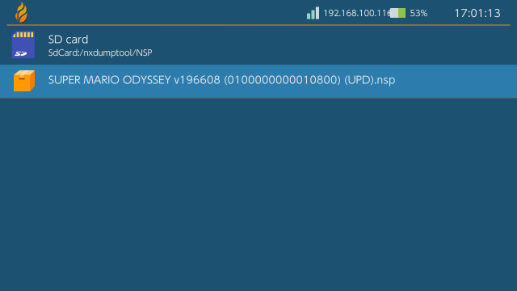

# Switch Dump and Install Guide
This guide has been made and tested using goldleaf 0.8.0, nxdumptool 1.1.9 and Gamecard Installer NX 2.0.0

!!! danger "Ban risk"
	Installing any sort of nsp's gets you banned as soon as you connect to Nintendo services. AFTER INSTALLING ANY NSP, KEEP YOUR SYSTEM PERMANENTLY OFFLINE!

!!! danger "EmuMMC is strongly recommended"
	Cause you need to keep your system offline after installing an nsp, EmuMMC is strongly recommended as with it you can still go online on sysnand while keeping your emummc permanently offline.

!!! warning "Remove all your wifi networks / set up 90dns on all your wifi networks"
	Again, in preparation for this you need to remove all your wifi networks or set up 90dns on all your wifi networks. Do this now. To set up 90dns, [click here](https://gitlab.com/a/90dns#usage-on-switch)

!!! note "How to update your patches"
	Currently supports Atmosphere 0.19.4 and firmware 12.0.3

	If you're just here to update your patches, you'll need to put the <a href="../Img/patches.ini" download>patches.ini from here</a> into the bootloader folder, replacing when asked. You may also need to replace the <a href="../Img/hekate_ipl.ini" download>hekate_ipl.ini</a> in the bootloader folder as well.

-----

# Cart install guide 

## Step 1: Preparations
This bit will get you the required files and programs for installing cart dumps

### What you need
- [Gamecard Installer NX](https://github.com/ITotalJustice/Gamecard-Installer-NX/releases)
- Your prod.keys file, generated by [Lockpick_RCM](https://github.com/shchmue/Lockpick_RCM/releases)
- <a href="../Img/hekate_ipl.ini" download>A Modified Hekate_ipl.ini</a>
- <a href="../Img/patches.ini" download>Hekate patches</a>

### Instructions
1. Copy the contents of the Gamecard Installer NX zip to your sd
2. Copy your prod.keys file to your switch folder, if you ran lockpick_rcm it will likely already be in the switch folder
3. Copy (or replace) `patches.ini` to the bootloader folder on your sd card
4. Replace the `hekate_ipl.ini` from the bootloader folder with the one you just downloaded
	- Note: if you're not using the hekate config from the nh guide, you can add `kip1patch=nosigchk` (and `kip1patch=noldrchk` if you're on 10.0.0+) right underneath the line with `fss0=x` instead of replacing your ini
	- Note: you need to be booting via hekate for this to work, fusee-primary will not work
	- Note: If you copied these files while booted into the switch os itself you need to restart your switch for the changes to take effect

## Step 2: The install

!!! note "If you haven't read the warnings on the top of the page yet, do so now"
	There is quite important information about ban risk up there.
	Also, if you haven't removed your wifi networks/set up [90dns](https://gitlab.com/a/90dns#usage-on-switch) yet, do so now

**Don't forget to boot into EmuMMC if you haven't done so already!!**

1. Open the Homebrew Menu and open Gamecard Installer NX
2. Press X to go into settings, and turn `Lower Keygen Version` ON, then exit out of the options menu
3. Select `SD Card Install` (or `Nand Install` if you're out of SD space), Then press A to confirm
4. Wait til the app finishes installing the game, then exit to the home menu. 

Take out your card and you'll find that your cart is now installed to the system. You're done!

If your game needs an update that is installed on your nand, you can continue with the Digital Dump Guide.

# Digital Dump Guide

## Step 1: Preparations 
This bit will get you the required files and programs for installing digital dumps

### What you need
- [The .nro version of GoldLeaf](https://github.com/XorTroll/Goldleaf/releases)
- [The .nro version of NXDumpTool](https://github.com/DarkMatterCore/nxdumptool/releases)
- <a href="../Img/hekate_ipl.ini" download>A Modified Hekate_ipl.ini</a>
- <a href="../Img/patches.ini" download>Hekate patches</a>
- Your prod.keys file, generated by [Lockpick_RCM](https://github.com/shchmue/Lockpick_RCM/releases)

### Instructions
1. Copy the .nro of Goldleaf and NXdumptool to the switch folder on your sd card
2. Place your prod.keys file into your switch folder, if you ran lockpick_rcm it will likely already be in the switch folder
3. Copy (or replace) `patches.ini` to the bootloader folder on your sd card
4. Replace the `hekate_ipl.ini` from the bootloader folder with the one you just downloaded
	- Note: if you're not using the hekate config from the nh guide, you can add `kip1patch=nosigchk` right underneath the line with `fss0=x` instead of replacing your ini
	- Note: you need to be booting via hekate for this to work, fusee-primary will not work
	- Note: If you copied these files while booted into the switch os itself you need to restart your switch for the changes to take effect

## Step 2: The Dump

### Instructions (Digital based dump)
1. Launch into Sys CFW via hekate (or if the game you want to dump is on EmuMMC, launch EmuMMC cfw)
2. Open the Homebrew Menu and open nxdumptool
3. Select `Dump installed SD card / eMMC content`
	- Note: to dump an update for a gamecard game, press `Y` to access the orphan title list.
4. Select the game you want to dump, then select `Nintendo Submission Package (NSP) dump`
5. If prompted, select `Dump base application NSP` (Redo  section if there's also an update to dump)
6. Turn the following options on: `Split output dump (FAT32 support)`, `Remove console specific data`, `Generate ticket-less dump` and `Change NPDM RSA key/sig in Program NCA`.
7. Select `Start NSP dump process`
8. After this is done, either dump your game update too, or return to the homebrew menu by pressing + (Don't forget to reboot into EmuMMC!!)

Your game dump got dumped in the /nxdumptool/nsp folder

## Step 3: The Install

!!! note "If you haven't read the warnings on the top of the page yet, do so now"
	There is quite important information about ban risk up there.
	Also, if you haven't removed your wifi networks/set up [90dns](https://gitlab.com/a/90dns#usage-on-switch) yet, do so now

**Don't forget to reboot into EmuMMC if you haven't done so already!!**

1. Open the Homebrew Menu and open Goldleaf
2. Select `Explore content`
3. Select `SD card`
4. Navigate to and select `switch`, then `nxdumptool`, then `NSP`. You should be here now:

6. Install your BASE dump of the game by selecting the nsp with A, then selecting `Install`, then selecting `SD card`, then selecting `Install` again
	- If you also dumped your game update, install the update nsp the same way too
7. After the install(s) finished installing, Press - to exit to the hbmenu or the home button to exit to the home menu.

You should now see your dump installed. You can delete or move the nsp files in /switch/nxdumptool/nsp to your pc.
